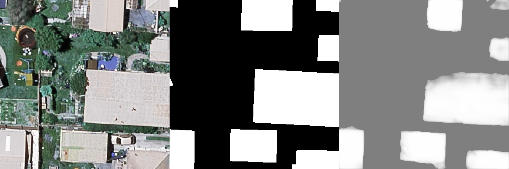

# UNET3+

This is a pytorch implemention of "UNET 3+ A FULL-SCALE CONNECTED UNET FOR MEDICAL IMAGE SEGMENTATION". This repo is an extension of the official [repo](https://github.com/ZJUGiveLab/UNet-Version) with training and evaluation code. The whole network can be trained end-to-end. The input is a colorful image in RGB, and the output is a binary image.

## Environment

* python 3.7
* pytorch >=1.7
* opencv-python
* tensorboardX

## Dataset

The dataset should be organised as following structure. The data folder should contain the folder ```image```, folder ```label``` and a ```train.txt``` file. The filename in both folders should be the same.

```sh
data
├── image
    └─imgname1.jpg
    └─imgname2.jpg
    └─...
├── label
    └─imgname1.jpg
    └─imgname2.jpg
    └─...
└── train.txt

```
The ```train.txt```file shoulde be organised as the following structure. No extension name.

```sh
train.txt
    └─imagename1
    └─imagename2
    └─imagename3
    └─...
```
Attention, because the network's final downsample multiple is 16, the resolution of the images in the dataset should be the integer multiple of 16, like 400\*400,320\*320, ext.

## Usage

### train

The network aims at learning a mapping function from ```imageA``` to ```imageB```. The ```train.py```file provide the following arg params:

```py
parser.add_argument('--trainA_path', type=str,
                    default='data/train/image')
parser.add_argument('--train_file', type=str,
                    default='data/train/train.txt')
parser.add_argument('--trainB_path', type=str,
                    default='data/train/label')
parser.add_argument('--lr', type=float, default=1e-4, help='learning rate')
parser.add_argument('--max_epoch', type=int, default=500,
                    help='Max epoch for training')
parser.add_argument('--bz', type=int, default=8,
                    help='batch size for training')
parser.add_argument('--num_workers', type=int, default=8,
                    help='Use multiple kernels to load dataset')
parser.add_argument('--checkpoints_root', type=str,
                    default='./checkpoints', help='The root path to save checkpoints')
parser.add_argument('--log_root', type=str, default='./log',
                    help='The root path to save log files which are writtern by tensorboardX')
parser.add_argument('--gpu_list', type=list,
                    default=[0, 1, 2, 3], help='Use multiple GPU to train the model')
```

An example of using is : 

```python train.py --trainA_path data/train/image --trainB_path data/train/label --train_file data/train/train.txt --max_epoch 100 --bz 4 --gpu_list 0,1,2,3```

The log files will be saved at ```./log``` folder, and the checkpoints will be saved at ```./checkpoint``` folder, which are named by date and time.
The training code supports multiple gpu training.
### Evaluation

There are 2 evaluation codes. 

```eval_img.py``` supports evaluating one image at one time. Run ```python eval_img.py --img_path test.jpg --checkpoint checkpoints/2021-11-01_00_56_52/chk_008.pth```, and the result will be saved as ```output.jpg```

```eval_folder.py``` supports evaluatng a folder of images at one time. Run ``` python eval_folder.py --img_folder test/images --output_folder output/test --checkpoing checkpoints/2021-11-01_00_56_52/chk_008.pth```, and the binary image results will be saved in ```./output/test```.

### An example 

From left to right is the input,label and the output.

